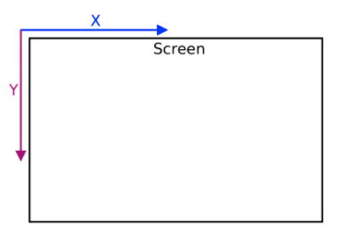
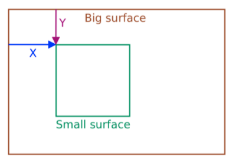
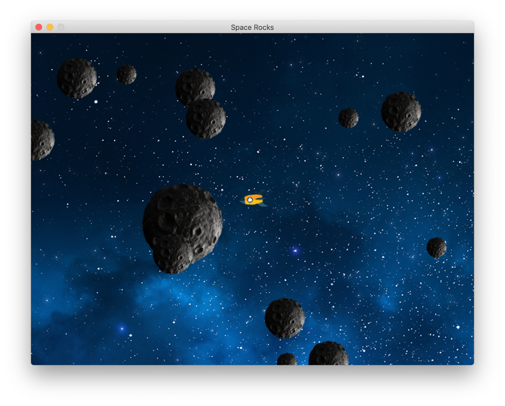

# Learning [PyGame](https://www.pygame.org/news) - Asteroid Game

## PyGame

### Coordinates in Pygame

## Screen Shots

## Example Games

## Credits

- [Real Python Tutorial](https://realpython.com/asteroids-game-python/)
- [FindSounds - free sounds](https://www.findsounds.com/ISAPI/search.dll?keywords=laser)
- [FreePNGimg - free png images](https://freepngimg.com/)
- [MOV to GIF](https://cloudconvert.com/mov-to-gif)

